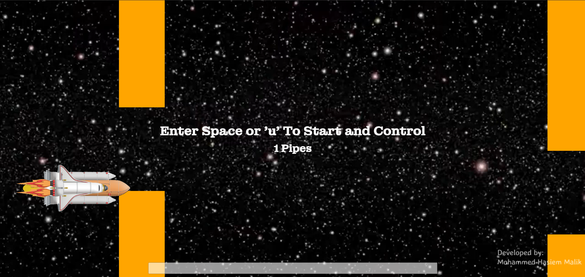
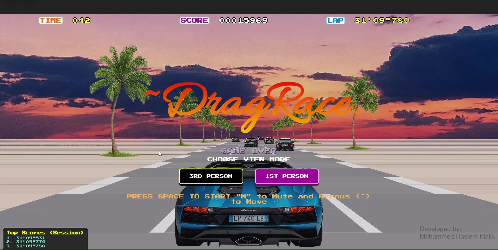
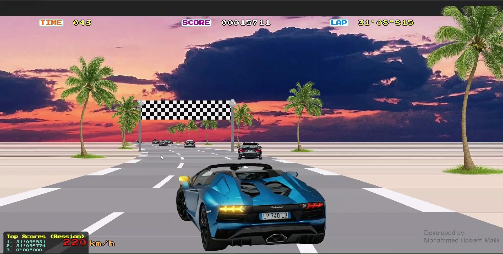
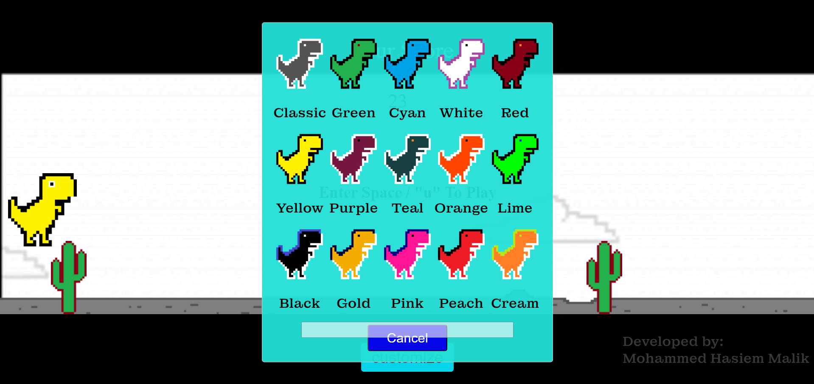
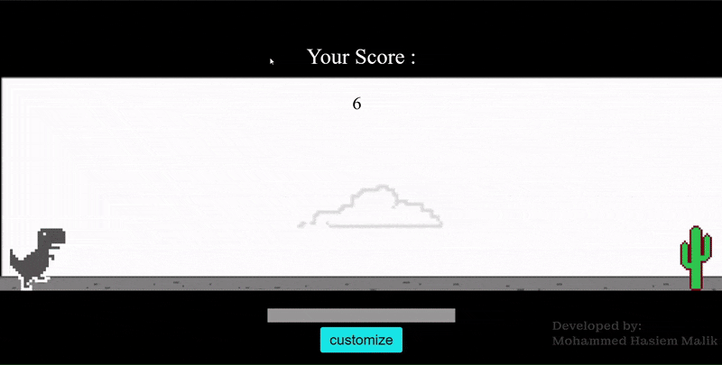

# Playnor
Visite the site here : [Playnor Website](https://mhasiemmalik.github.io/PlaynorHome/)
## Description

Welcome to the Games Corner, where users can immerse themselves in a collection of classic online games reminiscent of the early 2000s arcade era. Featuring beloved titles such as Space Shuttle, Chess, Pacman, Chrome Dino, Pong, and more, this website offers a nostalgic trip down memory lane. With a focus on OG Games arcade classics that were immensely popular in the early 2000s, like Pacman and others, users can experience the timeless charm of these iconic titles right from their browsers.

### Games

1. **Space Shuttle**

    An Age of classic arcade gaming is back with Space Shuttle! Relive the excitement. Navigate your shuttle through challenging space mission, dodge obstructions in your journey. With retro graphics and addictive gameplay, Space Shuttle brings the charm of classic arcade gaming to your fingertips. Get ready to blast off into a world of fun and nostalgia!

    
    
    [Visite the Module here](https://mhasiemmalik.github.io/PlaynorShuttle/)

3. **Pong**

    Relive the classic arcade experience with Pong! This timeless game brings back the nostalgia of simple yet addictive gameplay. Challenge the computer in fast-paced matches where you control a paddle to hit the ball back and forth. With its retro graphics, Pong captures the essence of early gaming. Whether you're a seasoned player or new to the game, Pong offers endless fun and competition. Get ready to serve, rally, and score in this classic arcade favorite!

    
    
    
    [Visite the Module here](https://mhasiemmalik.github.io/PlaynorPong/)

5. **Drag Race**

    Enjoy the thrill of high-speed racing with Drag Race! Experience the adrenaline rush as you compete in intense in the race track, rev your engines, and outpace your opponents. With its retro graphics and fast-paced gameplay in 2 modes First Person and Third Person controls. Enjoy immersive racing action that captures the essence of classic arcade racing games. Get ready to burn rubber and leave your competitors in the dust with Drag Race!

    
    
    
    [Visite the Module here](https://mhasiemmalik.github.io/PlaynorDragRace/)

6. **Chrome Dino**

    Introducing Chrome Dino, the endless runner game that brings excitement to your offline moments! When your internet connection drops, don't fret – just open Chrome and let Dino take you on an adventure. Guide the adorable dinosaur through a desert landscape, jumping over cacti and dodging obstacles to achieve the highest score possible. With its simple yet addictive gameplay, Chrome Dino is perfect for quick gaming sessions during downtime. Embrace the challenge, beat your high score, and enjoy the fun of this iconic offline game now in 2 modes!
     
    

    1. **Classic Mode**: Experience the original endless runner gameplay where Dino jumps over cacti with Customizations with over 16 Skins . Test your reflexes and aim for the highest score as the speed gradually increases.

    
    [Visite the Module here](https://mhasiemmalik.github.io/dngclassic/) 

    2. **Remastered Mode**: A new twist to the classic game! In This mode, Dino comes to life with enhanced graphics and dynamic environments never seen before, adding a fresh layer of excitement to the gameplay. Navigate through vibrant landscapes and enjoy a visually stunning experience while striving for the highest score!

    
    [Visite the Module here](https://mhasiemmalik.github.io/dngRMSD/)       

## Usage

Visit [Playnor Website](https://mhasiemmalik.github.io/PlaynorHome/) Choose your favorite game from the collection and start playing directly in your web browser. No downloads or installations required!
More Games coming soon...

##Technologies used: HTML, CSS, JavaScript

## Contributing

Contributions are welcome! Please follow the [contribution guidelines](CONTRIBUTING.md) when submitting pull requests.

## License

This project is licensed under the [MIT License](LICENSE).

## Contact

For any inquiries or support, feel free to contact us at [contact@example.com](mailto:contact@example.com).
